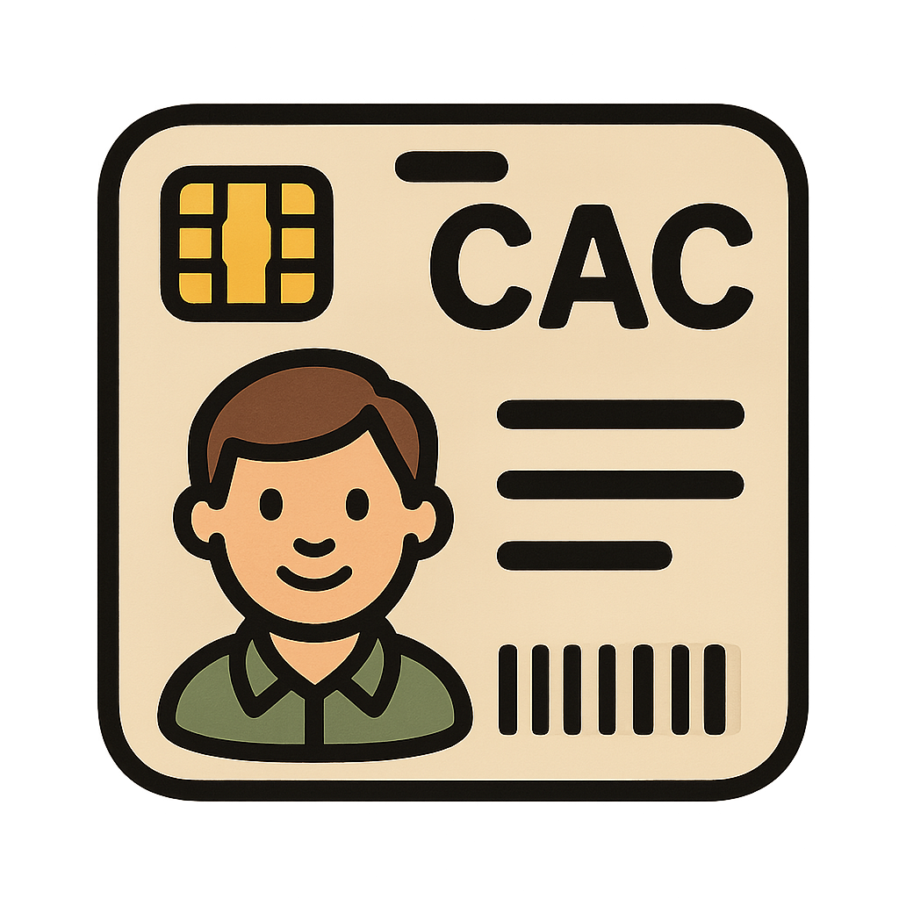

# CAC for Mac

> **Note:** This project is in very early development.

This repository contains the source code for the [cacformac.com](https://cacformac.com) website.

The site offers open-source guides, tools, and information for using smart cards on macOS. Whether you are a DoD employee, administrator, smart card user, or someone who issues smart cards, this site is designed to support your needs with up-to-date resources and practical solutions.

## Current Status

- Finalizing development of existing pages
- Add more images for pages
- Adding information about DoD Smart Card and YubiKey options
- Consolidating project-related scripts into the repository
- Automating the contributors page to pull directly from the repository
